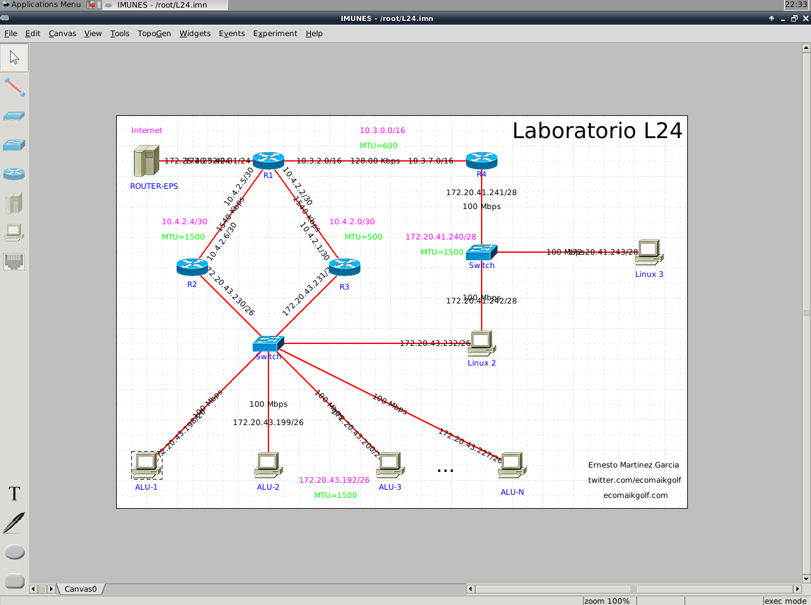
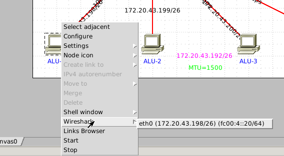
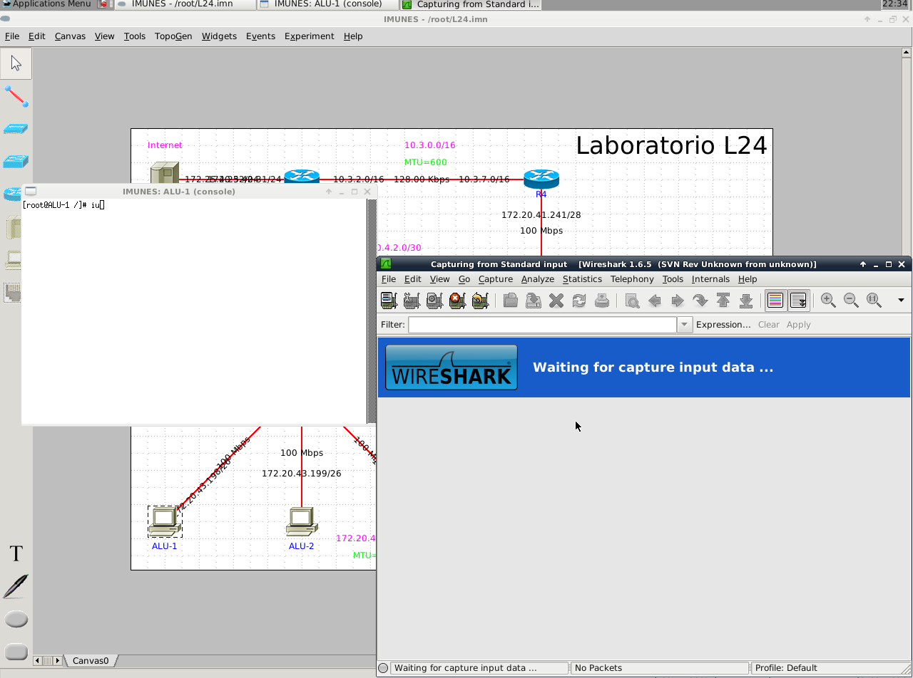
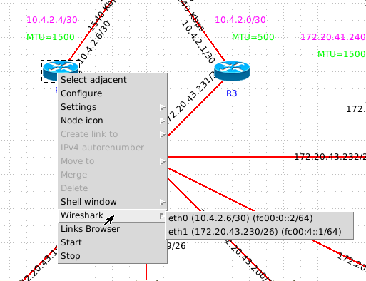
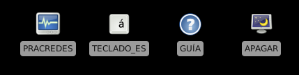

# L24-RC-IMUNES   
L24 Laboratory network simulation using IMUNES

* Git mirror: https://git.ecomaikgolf.com/L24-RC-IMUNES
* Preconfigured OVA: https://url.ecomaikgolf.com/L24-RC-IMUNES
* Credits to: http://imunes.net/

## Installation
### I don't have IMUNES
Download a preconfigured IMUNES `.ova` from [here](https://url.ecomaikgolf.com/L24-RC-IMUNES) and open it with VirtualBox.

**GUI**: Open VirtualBox > Press `Ctrl+I` > Search for `L24.ova`   
**CLI**: `vboxmanage import L24.ova`    

### I already have IMUNES
Open `L24.imn` with IMUNES

## Features
### Control the entire network

### Open a terminal in any machine/router

### 0% Noise

### Wireshark in every ethernet segment

### Easy to use

## Differences
* Network performance is not the same (but speed max. is)
* Linux 2 does not have a remote command service
* Does not have internet access
* Probably more
